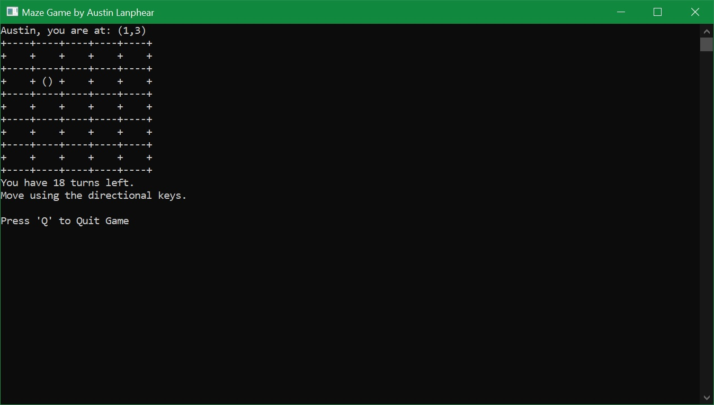

This project is a single file command window game.
The reason it was created using a single file instead of organizing into multiple files is because the course I am in didn't get to multi-file C++ linking and thus had to make the game with that limitation in mind.

Other than that the purpose of the game was to make a 5x5 Maze that a player has to explore.
In order to win the player must find the chest within the maze. However they only get 20 turns before they lose.
They also can encounter obstacles that will ask them questions pertaining to C++ and will get 2 tries before automatically losing.

These were the requirements I had for creating the project for my class. Although I could of hard-coded most values such as the width, height, and layout of the visual grid itself I opted to generate them instead.
Simply for the purpose of re-engineering them later so that if I continue this project I can modify it with ease and adjust values without needing to rewrite the program.

Hopefully this clears up any of the questions regarding why the project is a giant thousand lined mess of a single c++ file, instead of organized.

Download the Windows Build [Windows 10 32/64 Bit](./Console-Grid-Game.exe)

**Screenshot**

